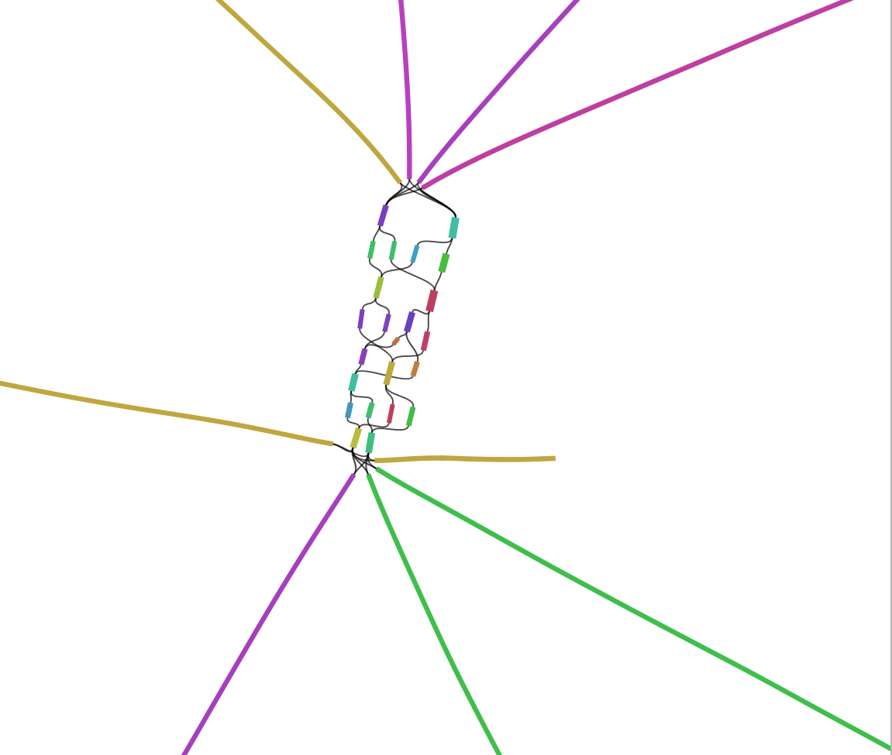

# Kassemble 
  
### Utility of proposal
`kassemble` is a Python package with the objective to assemble denovo contigs with a reference-free, k-mer based approach. The program is intended to be easy to install, easy to use, and well documented. `kassemble` offers a flexible approach to entering sample namesand the fastq data files associated with them. This makes it easy to accommodate single or paired-end data files, to combine technical replicates from different sequencing runs, or even to create pooled samples. `kassemble` uses the `SPAdes` [software tool](https://github.com/ablab/spades) to create contigs unique k-mers extracted from reads in a fastq file. As a wrapper around `SPades`, `kassembly` is intended to make it easier and aligned with the `kmerkit` [tool kit](https://github.com/eaton-lab/kmerkit.git). 


### Data sources and input
Genomic data contained in a .fastq format is the input data for `kassemble`. 


### User interaction and output
The preanalysis of the data that is imported into `kassemble` is produced by `kmerkit`. The documentation for kmerkit can be found
[here](https://github.com/eaton-lab/kmerkit.git). `kmerkit` counts kmers using `kcount`, filters unique kmers using `kfilter`, then extracts unqiue k-mers using `kextract`.

```bash
# write kmer databases for two samples to /tmp/test
kmerkit kcount --name test --workdir /tmp --sample A A.fastq.gz --sample B B.fastq.gz

# filter kmers to find those unique to B (not in A)
kmerkit kfilter --name test --workdir /tmp --mincov A 0.0 B 1.0 --maxcov A 0.0 B 1.0

# extract fastq reads that contain these kmers from sample B
kmerkit kextract --name test --workdir /tmp --samples A A.fastq.gz 
```

Then `kassemble` will incorporate the data produced from the previous pipeline in order to assemble reads into denovo conitgs. 

```bash
# assemble kmers into contigs
kassemble --name assembled --workdir /tmp-assembled/ --sample B B.fastq.gz 
```

`kassemble`is designed for use as a CLI and stores the following output files in <output_dir> , which is set by the user:

<output_dir>/contigs.fastq contains resulting contigs <br />
<output_dir>/assembly_graph.gfa contains assembly graph of contigs

For example, below is an example of `contigs.fastq` as a `assembly_graph.gfa` for E. coli produced by SPAdes.  



Figure 1. E. coli contig assembly graph created using SPAdes. 


### Installation 
```bash
# conda install kassembly -c conda-forge -c bioconda

git clone https://github.com/jasmina-dzurlic/Kassemble.git
cd kassemble
pip install -e .
``` 

### Related tools
`SPAdes` is a related tool that is incorporated in `Kassemble` as a python wrapper to perform de novo contig assemblies. The [documentation](https://github.com/ablab/spades) for `SPAdes` provides more detailed information about the program. `SOAPdenovo2` is also a contig assembly tool that performs similar assemblies and more information about this program can be found [here](https://github.com/aquaskyline/SOAPdenovo2). The shortcomings of `SOAPdenovo2` is that it is designed for short read assemblies and small genomes compared to `SPAdes` in which utilizes long-reads in a short-read assembly. In additon, `SPAdes`incorporates long reads to scaffold contigs from a short-read assembly. 
