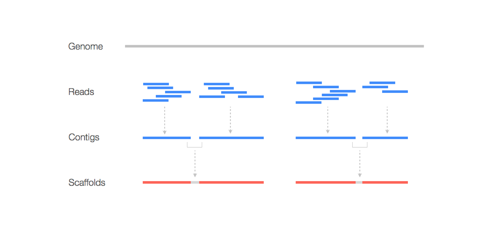
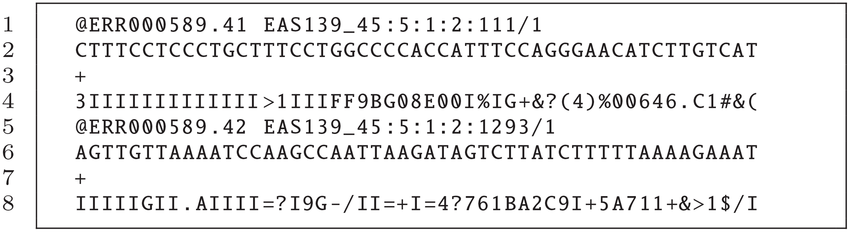

# Kassemble 

`kassemble` assembles extracted k-mers into denovo contigs to map the location in a genome. 

### Utility of proposal
`kassemble` will assemble reference-free genome wide associations (GWAS) with a k-mer based approach. For the class project, I will build the `kassemble` module that will assemble unique k-mers into denovo contigs in order to map the location of genetic variants detected. 



### Data sources and input
Genomic data in a .fastq format is the input data for `kassemble`. 



```bash
# Kassembly will take fastq files as input, or in the syntax here `--sample name fastqfile`
kassemble --name assembled --workdir /tmp-assembled/ --sample A A.fastq.gz
```

### User interaction and output 
My program...

```bash
# write kmer databases for two samples to /tmp/test
kmerkit kcount --name test --workdir /tmp --sample A A.fastq.gz --sample B B.fastq.gz

# filter kmers to find those unique to B (not in A)
kmerkit kfilter --name test --workdir /tmp --mincov A 0.0 B 1.0 --maxcov A 0.0 B 1.0

# extract fastq reads that contain these kmers from sample B
# *** this produces the filtered fastq files as output that you will want to use as input to your program 
kmerkit kextract --name test --workdir /tmp --samples A A.fastq.gz 
```

[add description sentence]

```python
import kassembly  

# DATA
FASTQS = "/tmp/*.fastq.gz"

# get dict mapping {sample_names: [fastq_files]}
fastq_dict = kassembly.get_fastq_dict_from_path(
    fastq_path=FASTQS, 
    name_split="_R",
)

# assemble kmers
Kassemble(
    name='test', 
    workdir='/tmp', 
    fastq_dict=fastqdict,
    kmersize=31,
    assemble_kmers="/tmp/kassemble_test",
).run()

```

### Installation 
```bash
# conda install kmerkit -c conda-forge -c bioconda

# for now, do dev installation with pip
git clone https://github.com/eaton-lab/kmerkit
cd kmerkit
pip install -e .
``` 

### Related tools
`SPAdes` is a related tool that will be incorporated as in `Kassembly` with a python wrapper to perform de novo contig assemblies. The [documentation](https://github.com/ablab/spades) for `SPAdes` provides more detailed information about the program. `SOAPdenovo2` is also a contig assembly tool that performs similar assemblies and more information about this program can be found [here](https://github.com/aquaskyline/SOAPdenovo2). The shortcomings of `SOAPdenovo2` is that it is designed for short read assemblies and small genomes compared to `SPAdes` in which utilizes long-reads in a short-read assembly. In additon, `SPAdes`incorporates long reads to scaffold contigs from a short-read assembly. 

 
